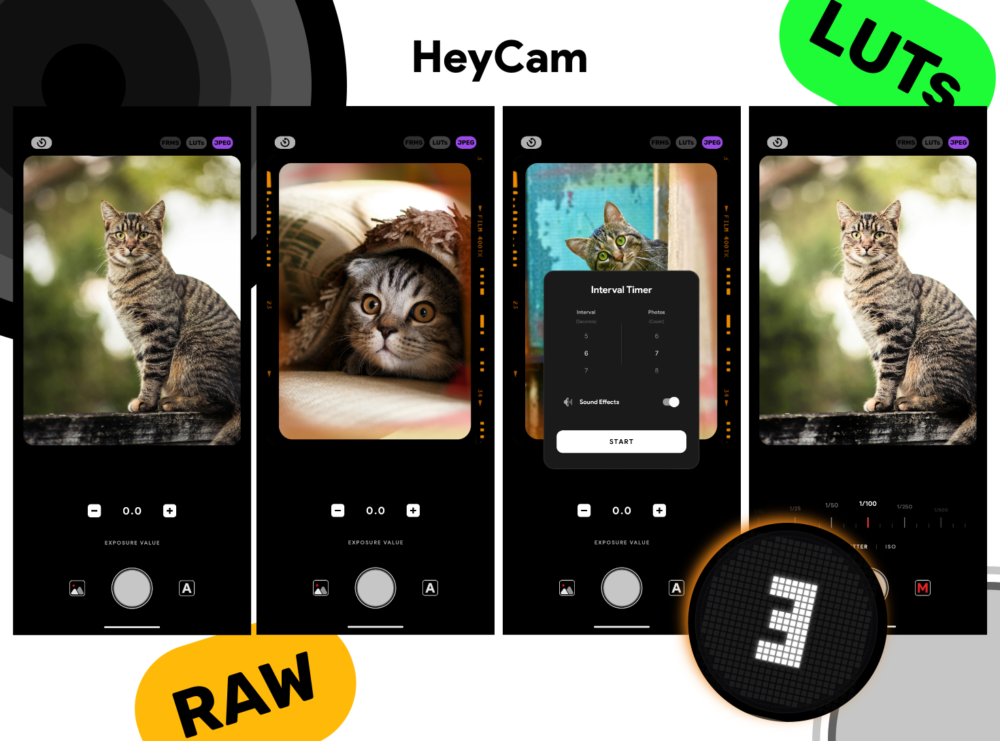

# HeyCam 📸

## The Story Behind HeyCam

I was tired of every phone's native camera app constantly processing photos behind the scenes. AI enhancements, aggressive noise reduction, over-sharpening - I wondered: **could I build a camera app with zero processing?**

My goal was simple: capture what the lens and sensor actually see, with minimal interference. I especially didn't want AI "improving" my photos. To achieve true control and zero processing, I created **HeyCam**.

## What is HeyCam?

HeyCam is a minimalist camera app with manual controls that lets you capture photos in both **JPEG** and **RAW (DNG)** formats. You have full control over **shutter speed** and **ISO**, putting the power back in your hands.

Since JPEG files still undergo some processing by Android's algorithms, I added **RAW support** for true zero-processing photography. 

**Want true zero processing?** Switch to **Manual mode** and shoot in **RAW format**. The photos might look flat or low-quality at first - but that's the point! You're getting the unprocessed image data straight from the sensor, with no interference from your device, Android, or any AI assistance.

## Features

### Auto Mode
- Tap anywhere on screen to auto-adjust shutter speed, ISO, and focus
- Quick and convenient for everyday shots

### Manual Mode
- Full control over shutter speed and ISO via interactive slider
- Current settings displayed on preview window
- Tap to focus only - exposure stays locked to your settings

### Format Options
- **JPEG**: Standard format with minimal processing
- **RAW (DNG)**: Zero processing, pure sensor data
- Switch between formats by tapping the format indicator in the top menu

### Technical Details
- **Rear camera only** - no front camera access
- **Main camera sensor only** - Due to Android and manufacturer restrictions, access to ultra-wide or telephoto lenses is limited
- **Zero processing in RAW mode** - All automatic corrections disabled:
  - Noise reduction: OFF
  - Edge enhancement: OFF
  - Hot pixel correction: OFF
  - Color correction: Minimal
  - Lens distortion correction: OFF

## Why RAW?

RAW files capture pure sensor data without processing. They may look:
- Flatter (lower contrast)
- Less saturated
- Softer (no sharpening)
- Noisier (no noise reduction)

This is **not** poor quality - it's **unprocessed reality**. Edit RAW files in Lightroom, Snapseed, or any RAW editor to achieve your desired look with maximum flexibility.

## Screenshots

*Coming soon*

## Installation

1. Download the latest APK from [Releases](../../releases)
2. Enable "Install from unknown sources" in your Android settings
3. Install and grant camera permissions

## Known Limitations

- Front camera not supported
- Limited to main rear camera sensor
- Some devices may have restricted RAW support
- Bugs may occur - I'm continuously improving the app when time permits

## Technical Stack

- **Language**: Java
- **Min SDK**: 24 (Android 7.0)
- **Target SDK**: 34
- **Camera API**: Camera2 API
- **Format Support**: JPEG, DNG (RAW)

## Contributing

Found a bug or have a feature request? Feel free to open an issue!

## License

*Add your preferred license here*

## Acknowledgments

Built with the goal of giving photographers true control over their mobile photography, free from unwanted AI processing and automatic "enhancements".

---

**Note**: This app is designed for photographers who want full manual control and understand RAW workflow. If you prefer point-and-shoot convenience with automatic enhancements, your phone's native camera app might be a better choice.